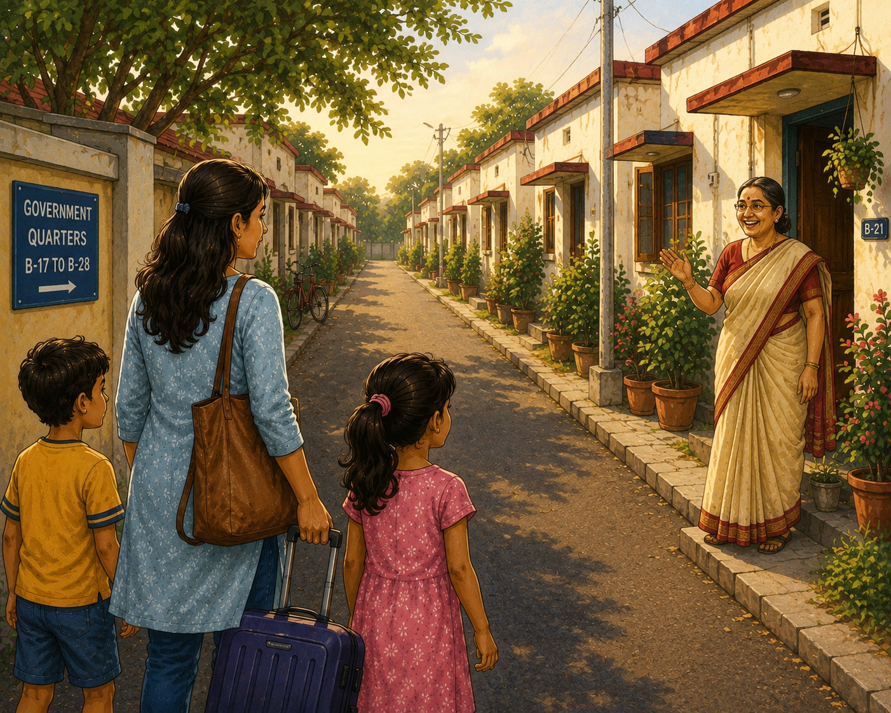
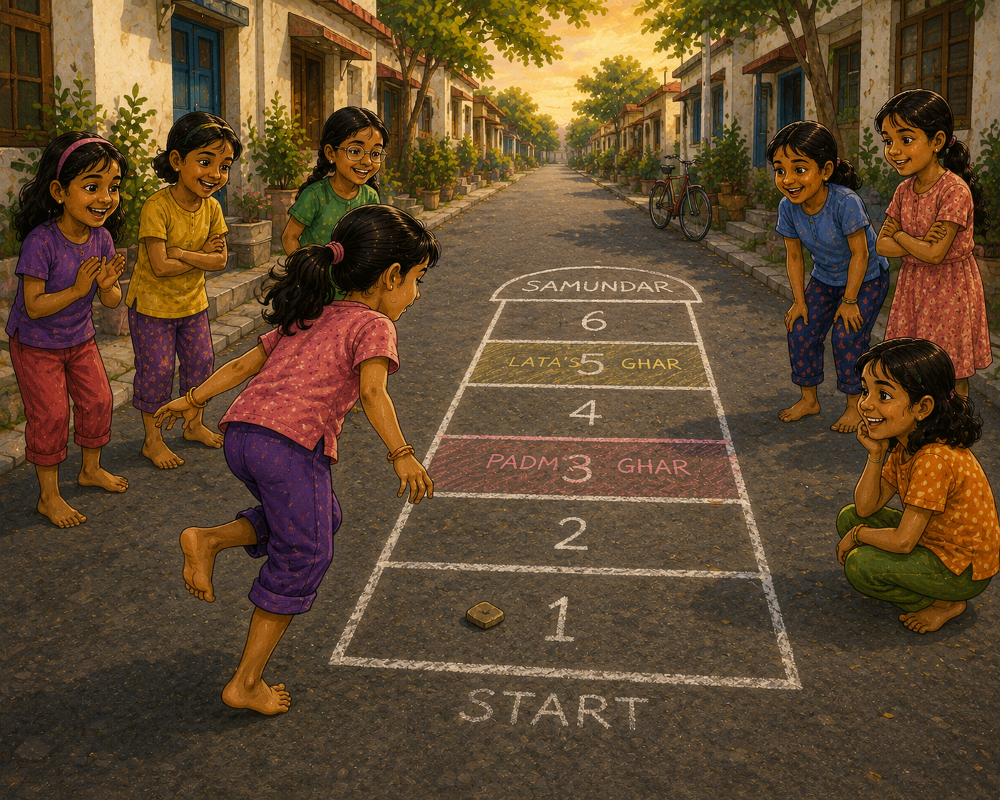
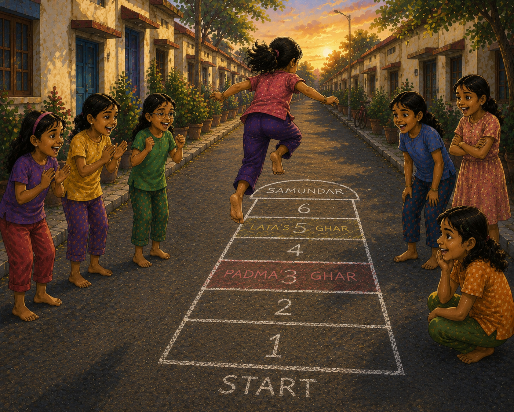
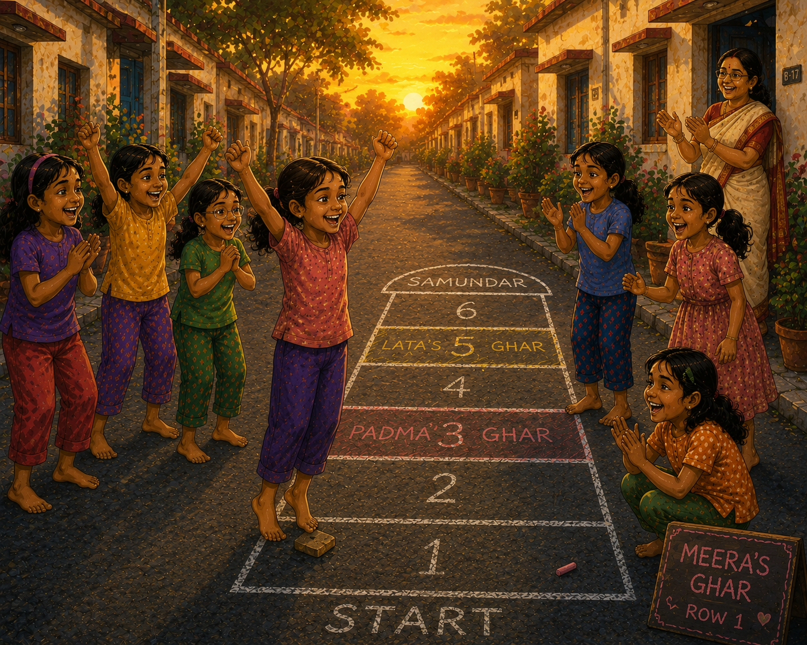
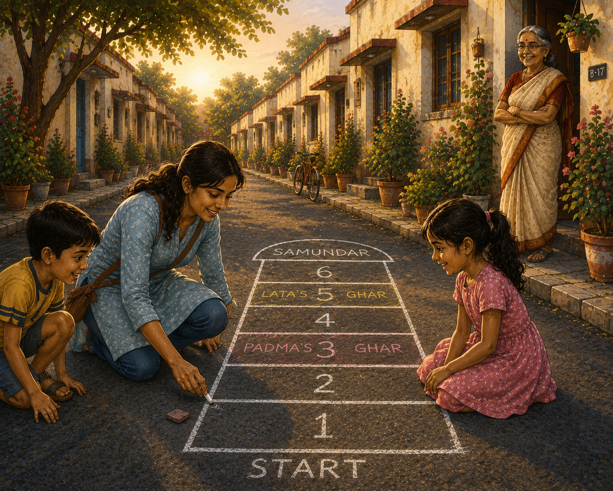

# The Chalk Lines

“Mama, were all these houses here when you were little?”

Meera smiled as she looked down the narrow tar road between the rows of government quarters.

“Every one of them.”

It was the summer holidays. She had brought her daughter Anya and her young son Arjun to visit their grandmother.

The colony looked smaller now than it had when she was a child. The neem trees were taller. Some houses had new paint. A few old families had moved away.

Yet the road was exactly where she remembered it.

The same road where every evening belonged to the children.

The same road where one particular game had once made her feel like a champion.

⸻

The sun was beginning to sink behind the quarters when ten-year-old Meera ran out of her house carrying her favorite chhipri—a smooth piece of broken roof tile.

Her friends were already waiting.

Padma.

Lata.

Rekha.

Sushma.

The Kith-Kith court had been drawn neatly across the tar road with white chalk.

But today’s game was unusually difficult.

Padma owned Row 3.

Lata owned Row 5.

Their Ghars blocked the court like obstacles.

“You’ll never finish today!” Lata announced proudly.

The other girls laughed.

Crossing one Ghar was hard.

Crossing two was nearly impossible.

Meera looked carefully at the court.

She would need perfect kicks.

Perfect jumps.

And a little luck.

When her turn came, she balanced on one foot outside Row 1.

The chhipri landed cleanly.

Hop.

Kick.

Hop.

Kick.

The tile moved steadily upward.

Soon she reached Row 2.

Ahead stood Padma’s Ghar.

Everyone fell silent.

Meera nudged the chhipri firmly.

The tile slid over Row 3 and stopped neatly in Row 4.

A cheer erupted.

Now came the jump.

She pushed off.

For a moment she seemed to float above the forbidden row.

Then she landed safely.

Padma groaned dramatically.

The game continued.

The second blockade was even harder.

Lata’s Ghar occupied Row 5, just below the Samundar.

Meera took a deep breath.

She kicked.

The chhipri skipped cleanly over Row 5 and settled in Row 6.

Another cheer.

Another leap.

Another perfect landing.

Now only the Samundar remained.

Meera stepped into the large top zone and rested both feet on the ground.

Her legs trembled from effort.

But she wasn’t finished.

She turned her back to the court.

Closed her eyes.

And tossed the chhipri backward over her head.

The girls watched the spinning tile.

It landed perfectly in Row 2.

“What a throw!” shouted Rekha.

The return journey began.

Meera hopped backward to Row 2.

Then she carefully pushed the chhipri downward through each row.

One mistake would end everything.

But the tile stayed true.

Finally she reached Row 1.

One last kick sent the chhipri completely outside the court.

Only the final leap remained.

Meera jumped forward.

The girls held their breath.

Both feet landed squarely on top of the chhipri.

For a moment nobody spoke.

Then the entire road exploded with cheers.

“She did it!”

“She crossed both Ghars!”

“Complete!”

Even Padma and Lata clapped.

Meera had conquered the blockade.

As her reward, she earned a chance to claim a Ghar of her own.

Standing at the start, she tossed the chhipri backward.

The tile landed neatly in Row 1.

The best possible Ghar.

The girls groaned.

“Oh no!”

“The court will be impossible tomorrow!”

Meera laughed until her sides hurt.

The evening sun painted the tar road gold.

It was the happiest day she could remember.

⸻

“Mama?”

The voice pulled Meera back to the present.

She blinked.

The cheering girls were gone.

The chalk lines had vanished.

The tar road lay quiet between the government quarters.

Anya was tugging at her hand.

“You were smiling.”

Meera looked down the road.

For a moment she had been ten years old again.

From the veranda, her mother watched knowingly.

“Thinking about Kith-Kith?” she asked.

Meera nodded.

“The greatest game ever.”

Her mother laughed.

“You children played that game every single day.”

Meera bent down and picked up a small flat stone from beside the road.

Then she looked at Anya and Arjun.

“Would you two like to play the greatest game ever?”

The children exchanged curious looks.

“Better than a video game?” Arjun asked.

“Much better.”

“Does it need batteries?”

“No.”

“Internet?”

“No.”

“What does it need then?”

Meera smiled and held up the stone.

“Just this.”

A few minutes later she was kneeling on the tar road, drawing familiar white lines with a piece of chalk.

One.

Two.

Three.

Four.

Five.

Six.

And finally the Samundar.

The children watched eagerly.

When she finished, she placed the chhipri in Row 1 and stood up.

The evening breeze rustled through the neem trees.

For just an instant, she thought she could hear Padma, Lata, Rekha and Sushma laughing somewhere nearby.

“Come on,” she said, beckoning the children forward.

“Let me show you how we spent our summer holidays.”

And as the first hop echoed across the old colony road, an old game found two new players.

---

[Kith Kith Game Play Guide](./kithkith.md)
