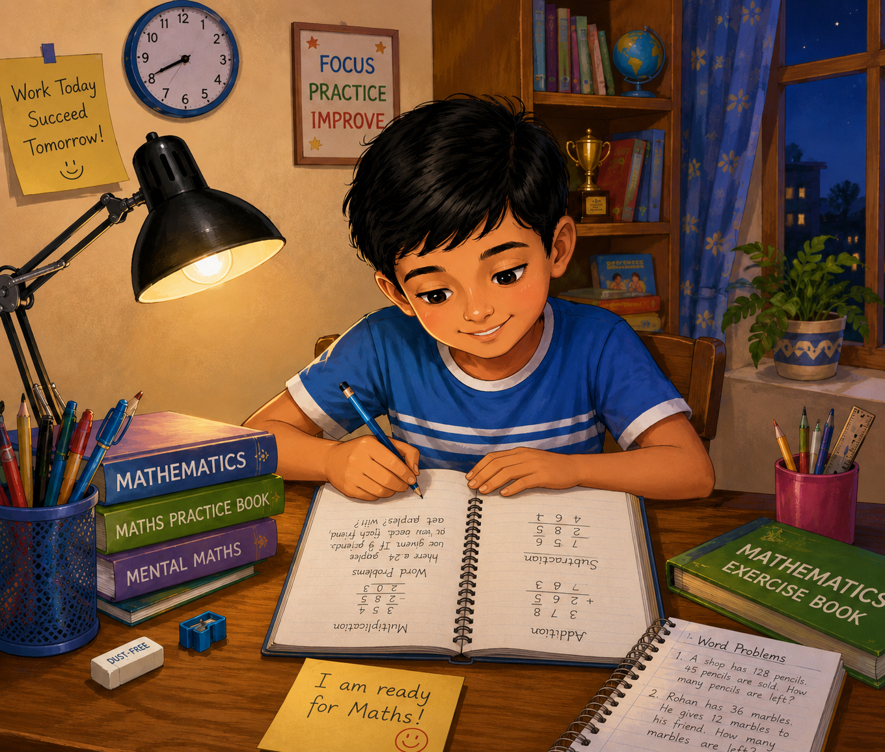
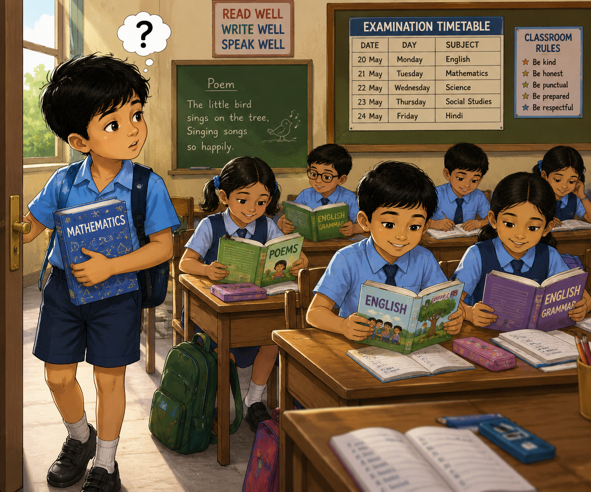
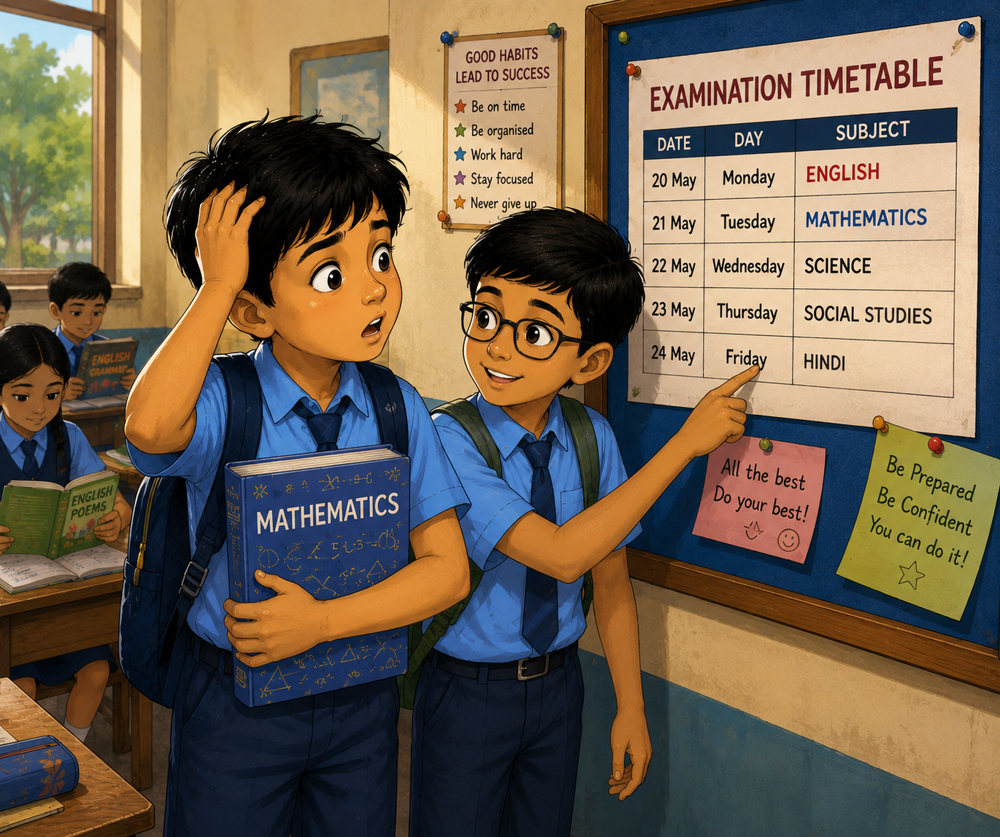
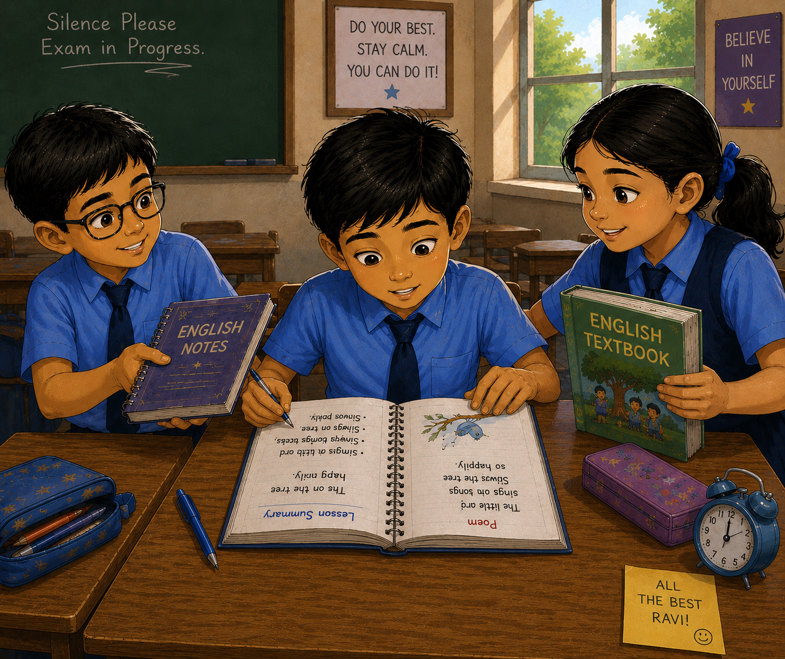
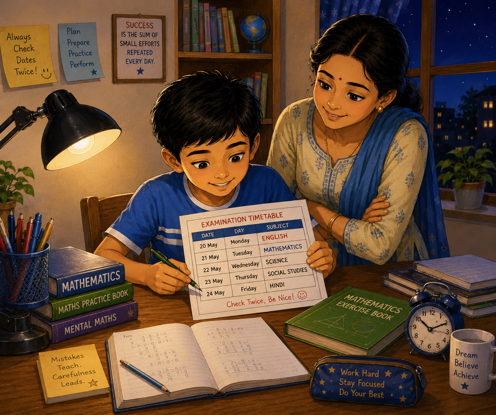

# The English Surprise

It was examination week at Vidyaniketan School.

Eight-year-old Ravi sat at his study table on Monday evening, surrounded by Mathematics books. Tomorrow was the Mathematics exam, and he wanted to do well.

For two hours he practised addition, subtraction, multiplication, and word problems. Before going to bed, he solved one last worksheet and smiled.

“I am ready for Maths!” he told his mother.

The next morning, Ravi walked confidently to school with his Mathematics textbook tucked under his arm.

As he entered the classroom, something seemed strange.

His friends were not discussing multiplication tables.

Instead, they were reading English textbooks.

One student was memorizing a poem. Another was revising grammar exercises.

Ravi stared at them.

“Why are you all studying English?” he asked.

His friend Kiran looked surprised.

“Because today’s English exam!” he replied.

Ravi laughed nervously.

“No, today is Mathematics.”

Kiran shook his head and pointed to the examination timetable pinned on the classroom notice board.

Ravi walked over and looked carefully.

His stomach twisted into a knot.

Kiran was right.

The English exam was today.

The Mathematics exam was tomorrow.

Ravi had copied the dates incorrectly into his notebook.

For a moment he felt like crying.

He had spent the whole evening preparing for the wrong subject.

Just then, Kiran handed him an English notebook.

“Take it,” he said. “We still have twenty minutes before the bell.”

Another friend shared her textbook.

Ravi quickly began reading.

He revised the poem they had learned in class.

He read the grammar notes.

He glanced through the lesson summaries.

The bell rang far too soon.

When the question paper arrived, Ravi took a deep breath.

Some questions were difficult, but Ravi smiled when he saw the poem and grammar exercises he had hurriedly revised before the bell.

He answered carefully and did his best.

When the bell rang and the papers were collected, Ravi let out a long breath.

“That wasn’t as bad as I feared,” he thought.

As the class walked out, Ravi turned to Kiran and his other friend.

“Thank you for helping me,” he said.

Kiran grinned.

“Next time, check the timetable first!”

Ravi laughed.

“I definitely will.”

That evening, while his friends relaxed after studying English, Ravi opened his Mathematics book once again.

After all, the Maths exam was actually the next day.

As he solved problems for the second time, he smiled.

“This extra work is my own fault,” he thought.

Before sleeping that night, Ravi checked the examination timetable once.

Then he checked it again.

His mother laughed.

“Making sure?” she asked.

Ravi grinned.

“Very sure.”

From that day onward, Ravi always verified important dates twice.

And whenever examination week arrived, he remembered the day he walked into an English exam carrying a Mathematics book.
